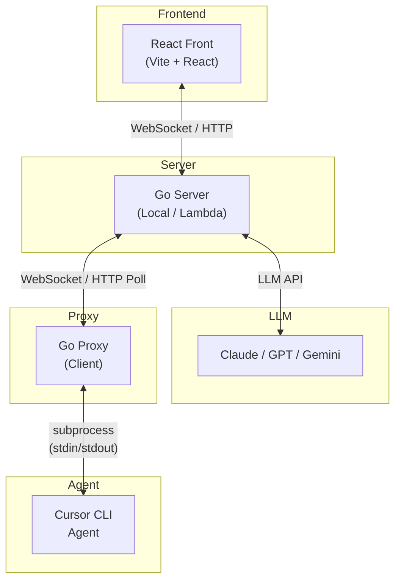

# go_samams_public
Sentinel Automated Multiple AI Management System


SAMAMS orchestrates multiple AI agents to automatically implement software projects. It manages the full lifecycle — from project planning through task decomposition, parallel agent execution, conflict resolution, and code merging.

---

## Table of Contents

1. [System Architecture](#1-system-architecture)
2. [Server Backend](#2-server-backend)
3. [Client Proxy](#3-client-proxy)
4. [Frontend](#4-frontend)
5. [Event System](#5-event-system)
6. [Infrastructure & Deployment](#6-infrastructure--deployment)
7. [Design Patterns](#7-design-patterns)
8. [Known Issues & Improvements](#8-known-issues--improvements)

---

## 1. System Architecture



**3-tier architecture**: Frontend (React) → Server (Go) → Proxy (Go) → AI Agent (Cursor CLI subprocess)

---

## 2. Server Backend

Located in `server/`.

### 2.1 Hexagonal Architecture + DDD

```
server/
├── cmd/                    # Entry points (Lambda handlers + local server)
├── infra/                  # Infrastructure adapters
│   ├── in/httpserver/      # Inbound: HTTP/WebSocket handlers
│   ├── out/llm/            # Outbound: LLM clients (Anthropic, OpenAI, Gemini)
│   ├── out/event/          # Outbound: Event publisher
│   ├── persistence/        # Outbound: Storage (inmemory, localstore)
│   └── out/mongodb/        # Outbound: MongoDB (unused)
├── internal/
│   ├── domain/             # Domain models (pure business logic)
│   └── app/                # Application services (use cases)
```

### 2.2 Core Domain Model

**Task Aggregate** (`server/internal/domain/task/`) — the most complex domain model:

- **State machine**: `Created → InProgress → {Done, Stopped, HardStopped, Cancelled, Redistributed}` (all terminal states are irreversible)
- **Execution Context**: Hierarchical execution context cascades from parent to child
  - `AccumulatedSummary`: Cumulative summary from ancestor tasks
  - `FrontierCommand`: Specific instructions for this task
  - `BuildChildContext()`: Accumulates own summary and passes it down to children

```go
// task/execution.go — Core pattern: parent context accumulation
func (t *Task) BuildChildContext() string {
    if t.Execution.AccumulatedSummary == "" {
        return t.Execution.OwnSummary
    }
    return t.Execution.AccumulatedSummary + "\n\n---\n\n" + t.Execution.OwnSummary
}
```

**Strategy Meeting** (`server/internal/domain/strategy/`):
- `RepeatedFailureTracker`: Emits `RepeatedFailureDetected` event after 5 consecutive failures
- `TokenUsage`: Detects anomalies when usage ratio exceeds 90%
- Meeting FSM: `Requested → Active → Resolved`

**Domain Events (Pull Pattern)**:
- Aggregates accumulate events in an internal `[]DomainEvent` slice
- Services collect them via `PullDomainEvents()` and publish to the EventBus
- Complete decoupling between aggregates and infrastructure

### 2.3 Multi-Provider LLM Integration

**Role-based LLM assignment** — optimized for cost and performance:

| Role | Provider | Model | Purpose |
|------|----------|-------|---------|
| **Planner** | Anthropic | claude-sonnet-4 | Plan generation, tree conversion, strategy analysis (16K tokens) |
| **LogAnalyzer** | OpenAI | gpt-4o-mini | Real-time log analysis (2K tokens, low cost) |
| **Summarizer** | Google | gemini-2.0-flash | Summarization, frontier command generation (4K–32K, batch efficient) |

**Frontier generation token scaling**: `4096 + (2000 × task_count)`, capped at 32K.

**Defensive LLM output parsing**:
- `EnforceTreeHierarchy()`: Strips markdown code fences, auto-corrects node types by depth
- `extractJSON()`: Brace-depth counting for robust JSON extraction
- Assumes LLM output is malformed and normalizes accordingly

### 2.4 Event Processor (Local Server)

`cmd/local/event_processor.go` — **Single Event Loop (Actor Pattern)**:

```go
type eventProcessor struct {
    ch   chan eventEnvelope  // incoming events
    done chan struct{}       // shutdown signal
    wg   sync.WaitGroup     // async work tracking
}
```

- **Fast path**: Business logic executes inline
- **Slow path**: LLM calls run in separate goroutines; results return via callback events
- **Key guarantee**: Single event loop prevents concurrent state mutations (no race conditions)

### 2.5 Strategy Meeting Orchestration

Full flow:
```
idle → pausing → analyzing → dispatching → idle

1. User/system triggers a strategy meeting
2. Server → Proxy: "Pause all agents"
3. Proxy: SIGINT to agents + spawn watch agents (collect .samams-context.md)
4. Proxy → Server: strategy.allPaused + each agent's analysis context
5. Server → Claude: Strategy analysis (conflict detection, task redistribution decisions)
6. Server → Proxy: Per-task decisions (keep / reset_and_retry / cancel)
```

Fallback on LLM analysis failure: **"keep all"** (resume every participant as-is).

---

## 3. Client Proxy

Located in `client/proxy/`.

### 3.1 Hexagonal Architecture

```
client/proxy/
├── cmd/agent-proxy/        # Entry point (build tags for local/deploy)
├── internal/
│   ├── domain/             # Domain models (Agent, Task, StateMachine, Event)
│   ├── port/               # 5 port interfaces
│   ├── adapter/
│   │   ├── inbound/        # cmdrouter (command routing), httpapi (debug API)
│   │   └── outbound/       # cursor, gitbranch, wsconn, httppoll
│   └── app/                # TaskService (core service)
```

### 3.2 Dual Communication Strategy (Build Tags)

- **`conn_local.go`** (default): Bidirectional WebSocket, 10-second heartbeat interval
- **`conn_deploy.go`** (`//go:build deploy`): HTTPS polling, adaptive interval (Active 3s / Idle 10s)

```go
// httppoll — critical events are never dropped
var criticalActions = map[string]bool{
    "task.completed": true, "task.failed": true,
    "milestone.merged": true, "contextLost": true,
}
```

### 3.3 Cursor CLI Integration

`adapter/outbound/cursor/runner.go`:

- **Process management**: Subprocess creation via `exec.CommandContext`, stdin/stdout pipes
- **CLI flags**: `--trust --print --yolo` (auto-approve mode)
- **Long prompt handling**: Prompts exceeding 4000 chars are written to `.samams-prompt.md`
- **Agent control**: SIGINT (pause), SIGKILL (force kill), stdin write (resume)
- **Platform-specific implementations**: `runner_unix.go`, `runner_windows.go`

### 3.4 Git Worktree-Based Isolation

`adapter/outbound/gitbranch/manager.go`:

```
~/.samams/workspaces/{project}/
  main/                   ← Main repository
  dev-MLST-0001-A/        ← Milestone worktree
  dev-TASK-0001-1/        ← Task worktree (agent workspace)
  hotfix-TASK-0002-1/     ← Hotfix branch
```

- **FIFO Merge Queue**: Serialized processing to prevent concurrent merge conflicts (max 20 pending)
- **Branch naming**: NodeType + UID (`dev-TASK-XXXX-X`, `hotfix-TASK-XXXX-X`)
- **Git hooks**: `pre-push` guard installed — blocks accidental pushes from agent worktrees, allows only local merges

### 3.5 State Machines (Agent + Task)

```go
// Agent FSM
idle → starting → running ↔ paused → stopped | error
//   running → idle (recycled for new task without teardown)

// Task FSM (proxy-side — more states than server)
pending → running → {done, stopped, error, scaling, resetting, cancelled}
//   paused ↔ running, error → resetting → running
```

**Multi-Agent Tasks**: A single task can have N agents assigned, with scale up/down support.

### 3.6 Command Router

`cmdrouter/handler.go` — 18 command types from server to proxy:

| Category | Commands |
|----------|----------|
| **Task lifecycle** | createTask, stopTask, pauseTask, resumeTask, cancelTask, scaleTask, resetTask |
| **Agent control** | stopAgent, sendInput, listAgents |
| **Strategy coordination** | strategyPauseAll, strategyApplyDecision |
| **Git** | mergeMilestone, createSkeleton |

Wildcard support: `taskID="*"` applies to all running/paused tasks.

---

## 4. Frontend

Located in `front/`.

### 4.1 Feature-Sliced Design (FSD)

```
front/src/
├── app/          # App.jsx, Router, Layouts, Providers
├── entities/     # Domain models (user, message, run, alert)
├── features/     # 8 feature modules
│   ├── agent-chat/       # Chat with agents
│   ├── auth/             # Firebase Google OAuth
│   ├── dashboard/        # Agent orchestration dashboard
│   ├── log-viewer/       # MAAL log viewer
│   ├── planning/         # AI-assisted project planning
│   ├── sentinel-monitor/ # Monitoring & alerts
│   ├── task-tree/        # Task tree canvas visualization
│   └── workspace/        # Sidebar/header layout
├── pages/        # Page-level components
└── shared/       # Shared utilities, UI components, API layer
```

### 4.2 Tech Stack

- **React 19** + **Vite 7** + **React Router 7**
- **State management**: Zustand 5 (client state), TanStack React Query 5 (server state)
- **Authentication**: Firebase 12 (Google OAuth → server token exchange)
- **Styling**: CSS Modules (45 `.module.css` files)
- **HTTP**: Axios (5-min timeout, auto token injection, 401 auto-refresh)

### 4.3 Zustand Stores (10 total)

| Store | Size | Purpose |
|-------|------|---------|
| `planningStore` | **693 lines** (largest) | AI plan generation, document editing, tree conversion, server persistence |
| `dashboardStore` | 94 lines | Agent polling (3s), strategy meeting management, log stream |
| `taskTreeStore` | 373 lines | Tree layout algorithm, canvas pan/zoom, proxy sync |
| `authStore` | 162 lines | Firebase auth + server token exchange + auto-refresh |
| `logViewerStore` | — | Client-side filtering, pagination |

### 4.4 API Communication

**Axios interceptor chain**:
1. **Request**: Automatic Bearer token injection from sessionStorage
2. **Response**: Auto-unwrapping of `{ ok: true, data: {...} }` envelopes
3. **401 handling**: Queue mechanism for concurrent 401s, auto-refresh via `/user/auth/refresh`, original request retry

**React Query defaults**: `staleTime: 30s`, `retry: 1`, `refetchOnWindowFocus: false`

### 4.5 Real-Time Synchronization (Polling-Based)

- **Dashboard**: 3s interval — `/run/agents`, `/run/logs`, `/run/progress`
- **Task Tree**: 3s interval — `syncFromProxy()` maps proxy task status → node status
- **Log Viewer**: 5s interval — `/run/logs` + client-side filtering
- **Sentinel**: 5s interval (when autoRefresh is enabled)

---

## 5. Event System

Located in `shared/domain/event/`.

### DSL-Based Code Generation

`events.json` → `go generate` → `event.generated.go` + Lambda handler scaffolds + OpenAPI spec

**Event structure**:
```go
type DomainEvent struct {
    EventName   string    // What happened
    OccurredAt  time.Time // When (deterministic via Clock interface)
    ActorType   string    // Actor kind (strategy, task, control)
    SubjectType string    // Subject entity
    Severity    string    // info, warning, error
    Payload     any       // Context-specific data
}
```

### 3-Level Task Hierarchy

```
Proposal (PROP-XXXX)            ← Entire project
  └── Milestone (MLST-XXXX-X)  ← Feature unit
       └── Task (TASK-XXXX-X)  ← Atomic work unit (single AI agent, single session)
```

Each task operates under **DDD Bounded Context isolation**: sibling tasks' files are marked as "DO NOT touch" zones in frontier commands.

---

## 6. Infrastructure & Deployment

### Dual Execution Modes

| | **Local Mode** | **Deploy Mode** |
|---|---|---|
| **Server** | Go HTTP server + in-memory/file storage | AWS Lambda + S3/DynamoDB |
| **Proxy ↔ Server** | WebSocket | HTTPS polling |
| **Persistence** | `~/.samams/store/` (JSON files, atomic writes) | S3 + SQS |
| **Event bus** | ConsolePublisher (stdout logging) | SQS/EventBridge |
| **Build** | `go build` | `go build -tags deploy` + Docker Lambda |

### Makefile Build Pipeline

- `codegen-events`: events.json → Go event constants/types
- `codegen-lambda`: events.json → Lambda handler scaffolds
- `codegen-openapi`: OpenAPI spec generation (including API Gateway variant)
- `build-push-lambda-images`: Push Lambda container images to ECR

---

## 7. Design Patterns

| Pattern | Location | Description |
|---------|----------|-------------|
| **Hexagonal Architecture** | Server + Proxy | Port/Adapter for complete domain ↔ infrastructure decoupling |
| **Domain Events (Pull)** | Server domain | Aggregates accumulate events internally → services pull and publish |
| **Single Event Loop** | Server local | Actor pattern preventing concurrent state mutations |
| **Async LLM + Callback** | Server event processor | LLM calls in separate goroutines; results return as callback events |
| **Build Tag Switching** | Proxy | `//go:build deploy` to switch between WS and HTTP polling |
| **FIFO Merge Queue** | Proxy git manager | Serialized merge processing to prevent concurrent conflicts |
| **Defensive LLM Parsing** | Server infra | Markdown stripping, tree correction, brace-depth counting |
| **Feature-Sliced Design** | Frontend | Feature-level module separation with clear layer boundaries |
| **Token Exchange** | Frontend auth | Firebase ID token → server access/refresh tokens |

---

## 8. Known Issues & Improvements

### High Priority

1. **Incomplete Lambda handlers** (`server/cmd/*/main.go`): All dependencies are injected as `nil` — will panic at runtime. Requires a DI container or proper wiring.
2. **Task.ChangeStatus() default-allow**: Transitions not explicitly forbidden may be allowed. Should switch to a default-deny pattern.
3. **Event loop panic recovery leak** (`event_processor.go`): Panic recovery does not call `wg.Done()`, potentially leaking goroutines.

### Medium Priority

4. **No transaction semantics**: Multi-aggregate changes are not atomic — state inconsistency possible if event publishing fails.
5. **Frontend type safety**: Pure JavaScript with no API response validation. TypeScript or Zod adoption recommended.
6. **sessionStorage token storage**: Vulnerable to XSS. HttpOnly cookies + CSRF tokens recommended.
7. **Polling overhead**: Dashboard 3s + TaskTree 3s + LogViewer 5s with no backoff. WebSocket migration recommended.

### Low Priority

8. **planningStore at 693 lines**: Should be split into document editing, AI generation, and chat sub-stores.
9. **Magic strings**: Status values hardcoded (`'running'`, `'paused'`). Should extract to enums/constants.
10. **No audit logging**: No persistent trail for strategy decisions or user actions.
11. **Stub provider masking**: Local stub always returns success responses, hiding real LLM integration failures.
