# SAMAMS Finite State Machines

All state machines identified in the SAMAMS codebase, organized by layer and domain.

---

## Table of Contents

1. [Client Proxy — Agent FSM](#1-client-proxy--agent-fsm)
2. [Client Proxy — Task FSM](#2-client-proxy--task-fsm)
3. [Server Domain — Task FSM](#3-server-domain--task-fsm)
4. [Server Domain — Strategy Meeting FSM](#4-server-domain--strategy-meeting-fsm)
5. [Server Domain — Project FSM](#5-server-domain--project-fsm)
6. [Server Local — Strategy Orchestration FSM](#6-server-local--strategy-orchestration-fsm)
7. [Server Local — Node Lifecycle FSM (tree.json)](#7-server-local--node-lifecycle-fsm-treejson)
8. [Server Domain — Control State (Snapshot Lifecycle)](#8-server-domain--control-state-snapshot-lifecycle)
9. [Cross-Cutting: Event-Driven Transitions](#9-cross-cutting-event-driven-transitions)
10. [Integrated System View](#10-integrated-system-view)

---

## 1. Client Proxy — Agent FSM

**Source:** `client/proxy/internal/domain/agent.go`, `client/proxy/internal/domain/statemachine.go`

The Agent FSM governs the lifecycle of an individual AI agent process (Cursor, Claude, or OpenCode). Transitions are validated by a mutex-protected `StateMachine` with an optional callback for logging.

| State | Value | Description |
|-------|-------|-------------|
| `idle` | `"idle"` | Agent created but not yet started, or returned to idle after completing a task cycle |
| `starting` | `"starting"` | Agent process is being spawned (CLI invocation in progress) |
| `running` | `"running"` | Agent process is alive and actively executing its prompt |
| `paused` | `"paused"` | Agent temporarily suspended (e.g., strategy meeting pause) |
| `stopped` | `"stopped"` | Agent gracefully terminated (normal shutdown or user stop) |
| `error` | `"error"` | Agent process crashed, timed out, or encountered an unrecoverable error |

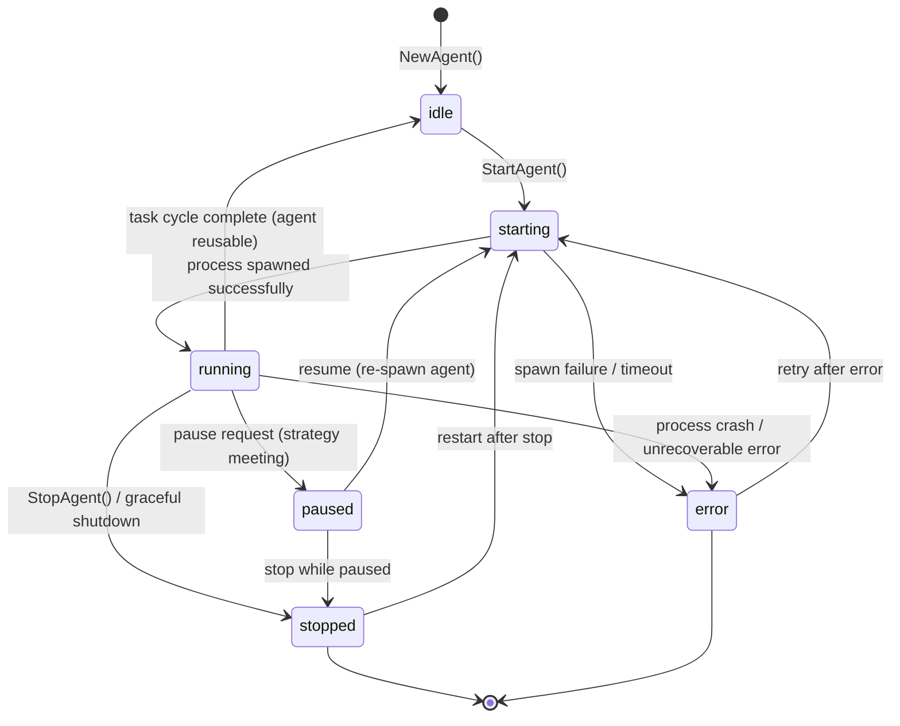

**Key implementation details:**
- `StateMachine.Transition()` acquires a mutex lock and checks the transition map before applying.
- `ForceSet()` bypasses validation for recovery scenarios.
- The `running → idle` transition is unique — it allows an agent to be recycled for a new task without full teardown.
- `AgentType` (cursor/claude/opencode) and `AgentMode` (plan/debug/execute) are orthogonal to the FSM — they determine the agent's capabilities, not its lifecycle state.

---

## 2. Client Proxy — Task FSM

**Source:** `client/proxy/internal/domain/task.go`, `client/proxy/internal/domain/statemachine.go`

The Task FSM tracks the lifecycle of a work unit on the proxy side. A task owns one or more agents. This FSM has more states than the server counterpart because it models proxy-specific orchestration concerns (scaling, resetting).

| State | Value | Description |
|-------|-------|-------------|
| `pending` | `"pending"` | Task created, waiting for agent assignment / dispatch |
| `planning` | `"planning"` | Task in context planning phase (pre-execution) |
| `running` | `"running"` | At least one agent is actively working on this task |
| `paused` | `"paused"` | All agents paused (strategy meeting or user request) |
| `scaling` | `"scaling"` | Agent pool is being resized (adding/removing agents) |
| `resetting` | `"resetting"` | Task context is being reset (new prompt, fresh agent) |
| `done` | `"done"` | **Terminal.** Task completed successfully |
| `stopped` | `"stopped"` | Task stopped (can be restarted) |
| `cancelled` | `"cancelled"` | **Terminal.** Task permanently cancelled |
| `error` | `"error"` | All agents failed; task needs intervention |

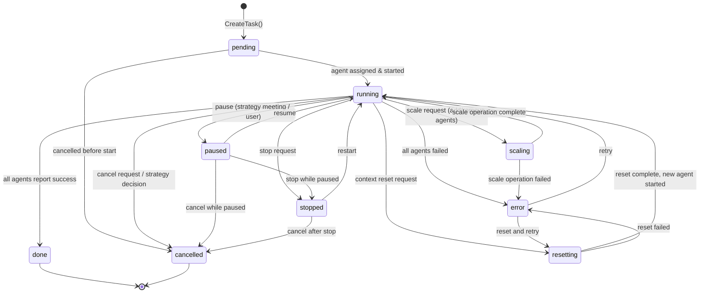

**Key implementation details:**
- `TransitionTask()` is a standalone function (not method on `StateMachine`) that validates against the `taskTransitions` map.
- `done` and `cancelled` are terminal states with no outbound transitions.
- `stopped` is non-terminal — a stopped task can be restarted or cancelled.
- `error` is non-terminal — recovery is possible via retry or reset.
- The `planning` state exists in the enum but has no transitions defined in `taskTransitions` — reserved for future use.

---

## 3. Server Domain — Task FSM

**Source:** `server/internal/domain/task/status.go`, `server/internal/domain/task/task.go`, `server/internal/domain/task/execution.go`

The server-side Task FSM is simpler than the proxy FSM. It tracks the canonical task status persisted in the domain layer (DynamoDB in Lambda mode, in-memory in local mode).

| State | Value (int32) | Description |
|-------|---------------|-------------|
| `Unknown` | 0 | Invalid / uninitialized |
| `Created` | 1 | Task created, not yet started |
| `InProgress` | 2 | Task is being executed by an agent |
| `Done` | 3 | **Terminal.** Completed successfully |
| `Stopped` | 4 | **Terminal.** Stopped by user or system |
| `HardStopped` | 5 | **Terminal.** Force-stopped (immediate kill, no cleanup) |
| `Cancelled` | 6 | **Terminal.** Cancelled by strategy decision or user |
| `Redistributed` | 7 | **Terminal.** Work redistributed to other tasks |

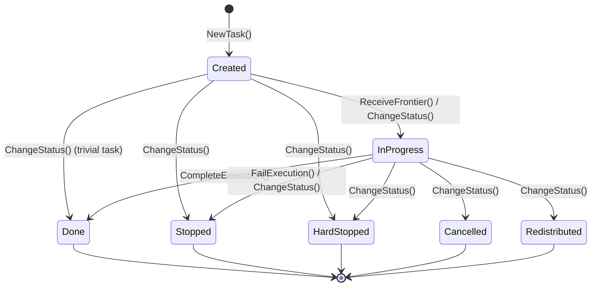

**Key implementation details:**
- `ChangeStatus()` validates transitions via a switch statement on the current status.
- All terminal states (`Done`, `Stopped`, `HardStopped`, `Cancelled`, `Redistributed`) reject transitions to any other state.
- `ReceiveFrontier()` implicitly transitions `Created → InProgress` by setting the accumulated summary and frontier command.
- `CompleteExecution()` implicitly transitions to `Done`.
- `FailExecution()` implicitly transitions to `Stopped`.
- The `ExecutionContext` tracks cascading data (parent summaries, execution results, child IDs) but is orthogonal to the FSM.

---

## 4. Server Domain — Strategy Meeting FSM

**Source:** `server/internal/domain/strategy/strategy.go`

The Strategy Meeting FSM is a simple 3-step lifecycle for collaborative decision-making sessions. When agents encounter repeated failures or conflicts, a strategy meeting is requested to analyze the situation and redistribute work.

| State | Value (int32) | Description |
|-------|---------------|-------------|
| `Unknown` | 0 | Invalid / uninitialized |
| `Requested` | 1 | Meeting requested (trigger detected: task failure, merge conflict) |
| `Active` | 2 | Meeting in progress (agents paused, analysis underway) |
| `Resolved` | 3 | **Terminal.** Decision made and recorded |

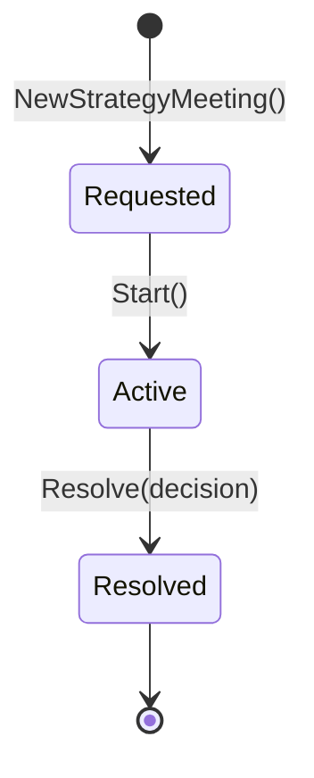

**Key implementation details:**
- Each transition emits a domain event (`StrategyMeetingRequested`, `StrategyMeetingStarted`, `StrategyMeetingResolved`).
- `Start()` requires current status to be `Requested`; otherwise returns `ConflictError`.
- `Resolve()` requires current status to be `Active`; stores the decision string.
- The meeting is immutable after resolution — no re-opening.

---

## 5. Server Domain — Project FSM

**Source:** `server/internal/domain/project/project.go`

The Project FSM is minimal — a project is either active or archived.

| State | Value (int32) | Description |
|-------|---------------|-------------|
| `Unknown` | 0 | Invalid / uninitialized |
| `Active` | 1 | Project is live and accepting tasks |
| `Archived` | 2 | **Terminal.** Project is archived |

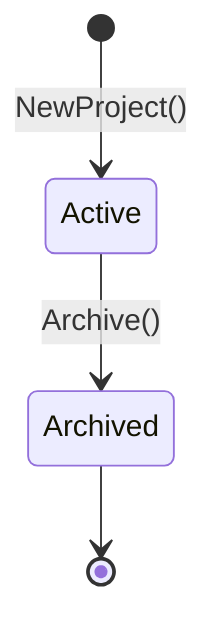

**Key implementation details:**
- `Archive()` is idempotent — calling it on an already-archived project is a no-op.
- There is no unarchive transition defined.

---

## 6. Server Local — Strategy Orchestration FSM

**Source:** `server/cmd/local/strategy_meeting.go`

This FSM governs the **orchestration** of a strategy meeting in local development mode. It is separate from the domain-level Meeting FSM (#4) — this one manages the multi-step process of pausing agents, running LLM analysis, and dispatching decisions back to the proxy.

State is persisted in `localstore` at key `strategy-meetings/current/meta.json`.

| State | Value (string) | Description |
|-------|----------------|-------------|
| `idle` | `"idle"` / `""` | No meeting in progress |
| `pausing` | `"pausing"` | Proxy is interrupting worker agents and spawning watch agents to collect context |
| `analyzing` | `"analyzing"` | LLM is analyzing collected discussion contexts from all agents |
| `dispatching` | `"dispatching"` | Decision made; sending `strategyApplyDecision` command to proxy |

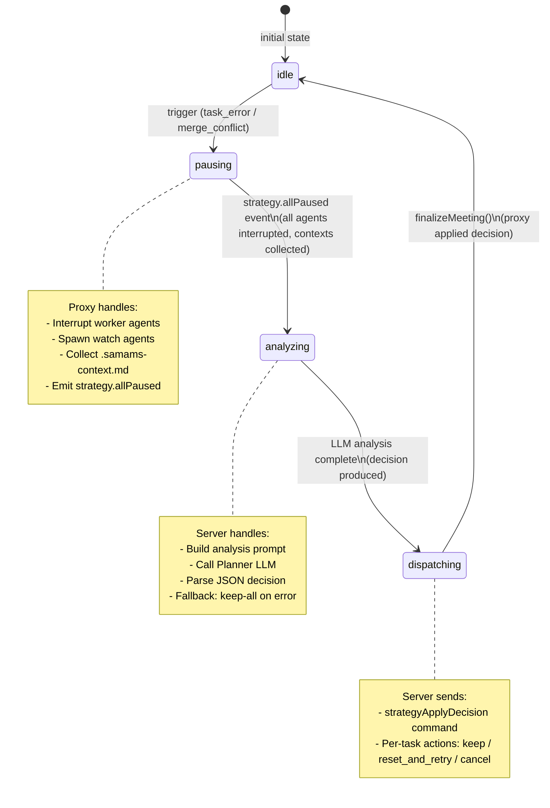

**Key implementation details:**
- `handleStrategyAllPaused()` transitions `pausing → analyzing` and triggers async LLM analysis.
- `resolveStrategyMeeting()` transitions `analyzing → dispatching` and sends the decision to the proxy.
- `finalizeMeeting()` transitions `dispatching → idle`.
- LLM failures produce a fallback decision of "keep all" (resume every participant as-is).
- Each participant missing from the LLM decision defaults to "keep".

---

## 7. Server Local — Node Lifecycle FSM (tree.json)

**Source:** `server/cmd/local/event_processor.go`, `server/cmd/local/event_helpers.go`

In local mode, the task tree (`tree.json`) tracks each node's status as a string. This is not a formally defined FSM in code, but the event processor enforces consistent transitions through its event handlers.

Nodes are hierarchical: **Proposal → Milestone → Task**.

| State | Value (string) | Description |
|-------|----------------|-------------|
| `pending` | `"pending"` | Node exists in tree, not yet dispatched |
| `running` | `"running"` | Agent is working on this node |
| `complete` | `"complete"` | Node finished successfully |
| `error` | `"error"` | Node failed (agent crash, merge conflict, etc.) |
| `reviewing` | `"reviewing"` | All children complete; code review agent dispatched |

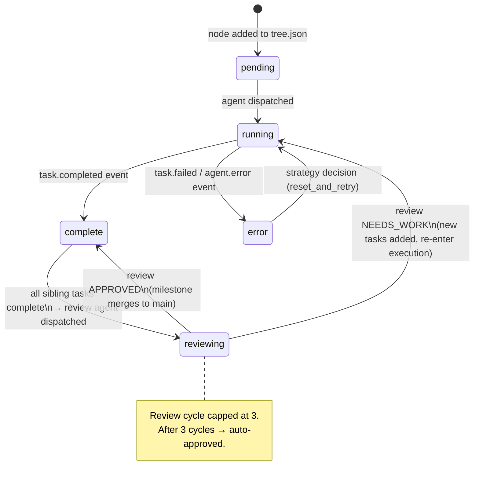

**Milestone completion flow:**
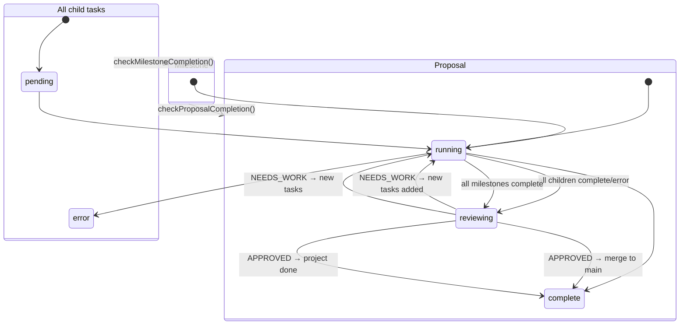

---

## 8. Server Domain — Control State (Snapshot Lifecycle)

**Source:** `server/internal/domain/control/control.go`

The Control domain does not have a traditional FSM. Instead, it implements an **event-sourced snapshot pattern** for context preservation and recovery.

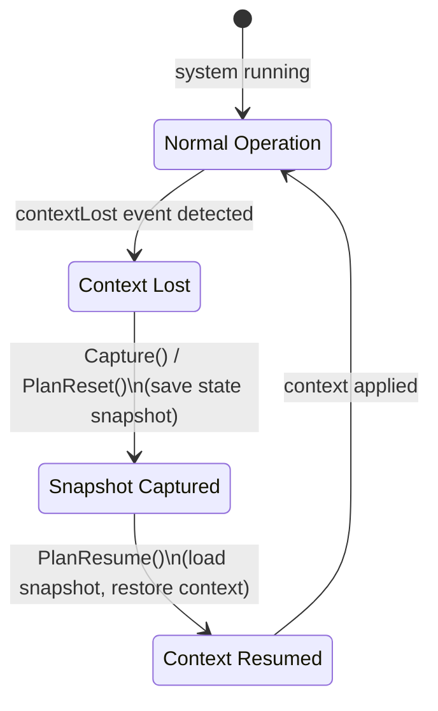

**Key implementation details:**
- `Capture()` saves a `Snapshot{StateID, Payload, SavedAt}` and emits `ControlStateCaptured`.
- `PlanReset()` captures state and additionally emits `ControlResetRequested`.
- `PlanResume()` emits `StateLoadedAndApplied` for the given snapshot ID.
- Multiple snapshots can coexist — `FindSnapshot(stateID)` retrieves a specific one.

---

## 9. Cross-Cutting: Event-Driven Transitions

State transitions across the system are coordinated via domain events. The table below maps events to the FSMs they affect.

| Event | Source | Triggers Transition In |
|-------|--------|----------------------|
| `task.created` | Server Task Service | Server Task: `→ Created` |
| `task.status_updated` | Server Task Service | Server Task: any valid transition |
| `task.completed` | Proxy (via WebSocket) | Node Lifecycle: `running → complete`; triggers milestone check |
| `task.failed` | Proxy (via WebSocket) | Node Lifecycle: `running → error`; may trigger strategy meeting |
| `task.cancelled` | Strategy decision | Proxy Task: `→ cancelled` |
| `task.hard_stopped` | Usage limit / user | Server Task: `→ HardStopped` |
| `task.redistributed` | Strategy decision | Server Task: `→ Redistributed` |
| `agent.stateChanged` | Proxy agent process | Agent FSM: any transition; logs to track |
| `agent.error` | Proxy agent process | Agent FSM: `→ error`; Node: `→ error` |
| `strategy.meetingRequested` | Event processor | Meeting FSM: `→ Requested`; Orchestration: `idle → pausing` |
| `strategy.allPaused` | Proxy | Orchestration: `pausing → analyzing` |
| `strategy.meetingStarted` | Strategy Service | Meeting FSM: `Requested → Active` |
| `strategy.meetingResolved` | Strategy Service | Meeting FSM: `Active → Resolved` |
| `strategy.decisionApplied` | Proxy | Orchestration: `dispatching → idle` |
| `control.context_reset` | Control Service | Control: snapshot captured |
| `control.context_loaded` | Control Service | Control: snapshot resumed |
| `contextLost` | Proxy detection | Control: triggers `ContextLostDetected` |
| `milestone.review.completed` | Proxy review agent | Node: `reviewing → complete` or `→ running` |
| `milestone.review.failed` | Proxy review agent | Node: auto-approved `→ complete` |
| `milestone.merged` | Git merge operation | Informational (no state change) |

---

## 10. Integrated System View

This diagram shows how the FSMs interact across system boundaries.

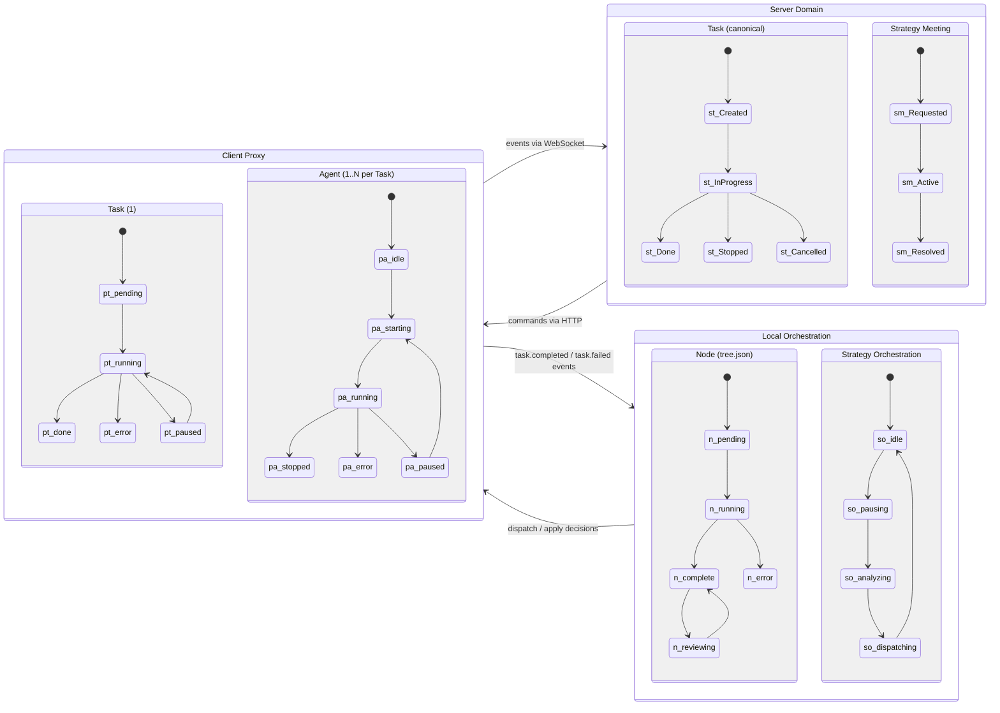

### End-to-End Task Execution Sequence

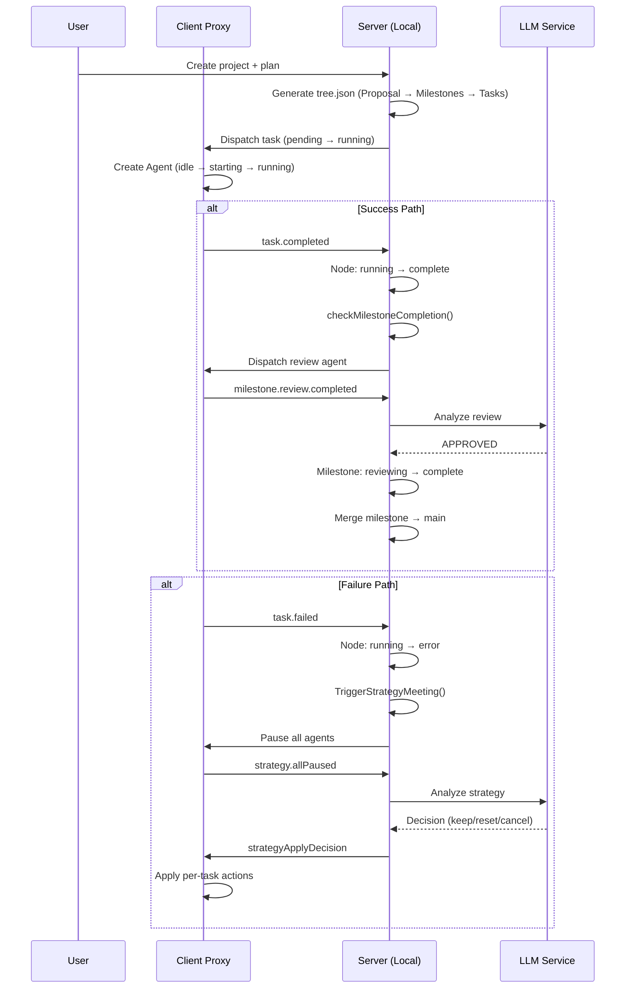

---

## Appendix: State Enum Definitions (Quick Reference)

### Client Proxy

```go
// Agent Status — client/proxy/internal/domain/agent.go
type AgentStatus string
const (
    AgentStatusIdle     AgentStatus = "idle"
    AgentStatusStarting AgentStatus = "starting"
    AgentStatusRunning  AgentStatus = "running"
    AgentStatusPaused   AgentStatus = "paused"
    AgentStatusStopped  AgentStatus = "stopped"
    AgentStatusError    AgentStatus = "error"
)

// Task Status — client/proxy/internal/domain/task.go
type TaskStatus string
const (
    TaskStatusPending   TaskStatus = "pending"
    TaskStatusPlanning  TaskStatus = "planning"
    TaskStatusRunning   TaskStatus = "running"
    TaskStatusPaused    TaskStatus = "paused"
    TaskStatusDone      TaskStatus = "done"
    TaskStatusStopped   TaskStatus = "stopped"
    TaskStatusCancelled TaskStatus = "cancelled"
    TaskStatusError     TaskStatus = "error"
    TaskStatusScaling   TaskStatus = "scaling"
    TaskStatusResetting TaskStatus = "resetting"
)
```

### Server Domain

```go
// Task Status — server/internal/domain/task/status.go
type Status int32
const (
    StatusUnknown       Status = iota  // 0
    StatusCreated                       // 1
    StatusInProgress                    // 2
    StatusDone                          // 3
    StatusStopped                       // 4
    StatusHardStopped                   // 5
    StatusCancelled                     // 6
    StatusRedistributed                 // 7
)

// Strategy Meeting Status — server/internal/domain/strategy/strategy.go
type MeetingStatus int32
const (
    MeetingStatusUnknown   MeetingStatus = iota  // 0
    MeetingStatusRequested                        // 1
    MeetingStatusActive                           // 2
    MeetingStatusResolved                         // 3
)

// Project Status — server/internal/domain/project/project.go
type Status int32
const (
    StatusUnknown  Status = iota  // 0
    StatusActive                   // 1
    StatusArchived                 // 2
)
```
